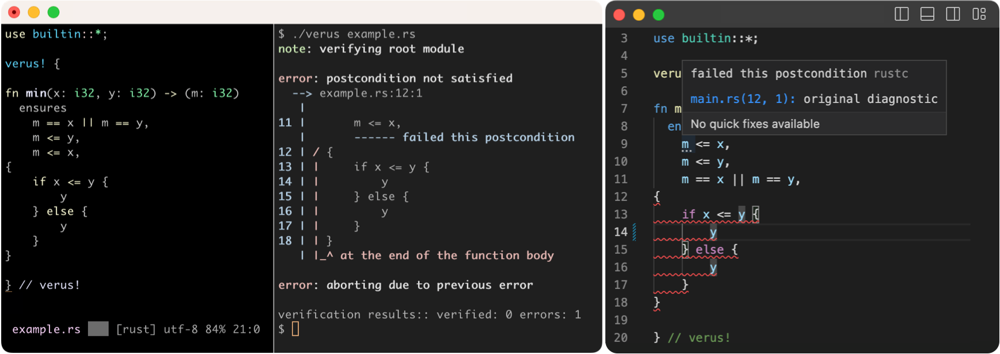

  

Verus is a tool for verifying the correctness of code written in Rust.
Developers write specifications of what their code should do,
and Verus statically checks that the executable Rust code will always 
satisfy the specifications for all possible executions of the code.
Rather than adding run-time checks, Verus instead relies on powerful solvers to
prove the code is correct.  Verus currently supports a subset of Rust (which we
are working to expand), and in some cases, it allows developers to go beyond
the standard Rust type system and statically check the correctness of code
that, for example, manipulates raw pointers.  

## Status

Verus is under *active development*. Features may be broken and/or missing, and
the documentation is still incomplete. If you want to try Verus, please be
prepared to ask for help in the [💬 Zulip](https://verus-lang.zulipchat.com/).

The Verus community has published a number of research papers, and there are a variety of industry and academic projects using Verus. You can find a list on our <a href="https://verus-lang.github.io/verus/publications-and-projects/">publications and projects</a> page. If you're using Verus please consider adding your project to that page (see the instructions there).

## Try Verus

To try Verus in your browser, please visit the [Verus Playground](https://play.verus-lang.org/).
For more involved development, please follow our [installation instructions](INSTALL.md).
Then you can dive into the documentation below, starting
with the [📖 Tutorial and reference](https://verus-lang.github.io/verus/guide/).

## Documentation
Our (work-in-progress) documentation resources include:
 * [📖 Tutorial and reference](https://verus-lang.github.io/verus/guide/)
 * [📖 API documentation for Verus's standard library](https://verus-lang.github.io/verus/verusdoc/vstd/)
 * [📖 Guide for verifying concurrent code](https://verus-lang.github.io/verus/state_machines/)
 * [Project Goals](source/docs/project-goals.md)
 * [Contributing to Verus](CONTRIBUTING.md)
 * [License](LICENSE)

## Getting in touch, reporting issues, and starting discussions

Please report issues or start discussions here on GitHub, or join us on [💬 Zulip](https://verus-lang.zulipchat.com/) for more realtime discussions and if you need help. Thank you for using and contributing to Verus!

We use GitHub discussions for feature requests and more open-ended conversations about
upcoming features, and we reserve GitHub issues for actionable issues (bugs) with
existing features. Don't worry though: if we think an issue should be a discussion (or
vice versa) we can always move it later.

We welcome contributions! If you'd like to contribute code, have a look at the tips in
[Contributing to Verus](CONTRIBUTING.md).

---

[ Zulip](https://zulip.com/) sponsors free hosting for Verus. Zulip is an open-source modern team chat app designed to keep both live and asynchronous conversations organized.
