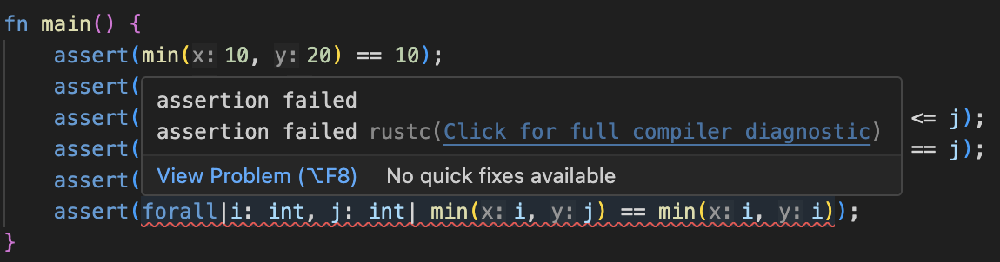

# Getting started with VSCode

This page will get you set up using Verus in VSCode using the [verus-analyzer](https://github.com/verus-lang/verus-analyzer) extension. Note that verus-analyzer is **very experimental.**

## 1. Create a Rust crate

Install [cargo](https://doc.rust-lang.org/cargo/getting-started/installation.html) if you
haven't yet.
Find a scratch directory to use, and run:

```
cargo init verus_test
```

This will create the following files:

 * `verus_test/Cargo.toml`
 * `verus_test/src/main.rs`

## 2. Install verus-analyzer via VSCode

Open VSCode and install verus-analyzer through the VSCode marketplace.

## 3. Open your workspace in VSCode.

Go to `File > Open Folder` and select the `verus_test` directory.

## 4. Disable rust-analyzer

If you have rust-analyzer installed, you'll want to disable it, as it is redundant and (without the proper configuration) will result in additional errors that you won't want to see.

To disable rust-analyzer, go to the extensions panel, find rust-analyzer, click the
gear icon, and select **"Disable (Workspace)"**. (This will disable rust-analyzer only
for the current workspace.)
Then click the blue **"Restart Extensions"** button that appears.

## 5. Test that Verus is working.

Within your `verus_test` project, navigate to the `src/main.rs` file. Paste in the following:

```rust
use vstd::prelude::*;

verus! {

spec fn min(x: int, y: int) -> int {
    if x <= y {
        x
    } else {
        y
    }
}

fn main() {
    assert(min(10, 20) == 10);
    assert(min(-10, -20) == -20);
    assert(forall|i: int, j: int| min(i, j) <= i && min(i, j) <= j);
    assert(forall|i: int, j: int| min(i, j) == i || min(i, j) == j);
    assert(forall|i: int, j: int| min(i, j) == min(j, i));
    assert(forall|i: int, j: int| min(i, j) == min(i, i));
}

} // verus!
```

Save the file in order to trigger verus-analyzer.

This program has an error which Verus should detect.
If everything is working correctly, you should see an error from Verus on the final `assert` line:



If you click the link, "Click for full compiler diagnostic", you should see an error like:

```
error: assertion failed
  --> verus_test/src/main.rs:19:12
   |
19 |     assert(forall|i: int, j: int| min(i, j) == min(i, i));
   |            ^^^^^^^^^^^^^^^^^^^^^^^^^^^^^^^^^^^^^^^^^^^^^ assertion failed
```

Delete this line, and now Verus should say that the file verifies successfully.

## 6. Learn more about the verus-analyzer extension.

See [the verus-analyzer README](https://github.com/verus-lang/verus-analyzer) for more information and tips on using verus-analyzer.

## 7. Learn more about Verus

[Continue with the tutorial](./verus_macro_intro.md), starting with an explanation of the `verus!` macro from the above example.
