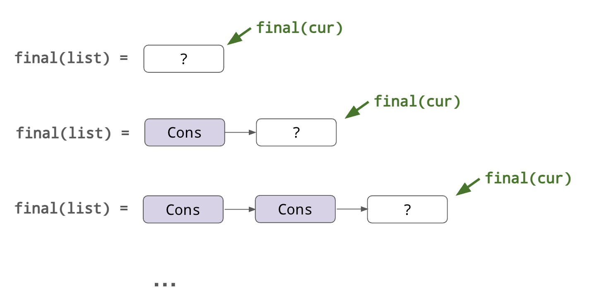

# Mutable references

For simple uses of mutable references—i.e., within a single function, and without involving
loops—Verus's proof strategy can usually track mutable references precisely and without much trouble. 
For example:

```rust
fn example1() {
    let mut a = 0;
    let a_ref = &mut a;

    *a_ref = 5;

    assert(a == 5);
}
```

Or:

```rust
fn example1() {
    let mut a = Some(0);

    match a {
        Some(inner_ref) => {
            // Obtain a reference to the contents of the Option
            *inner_ref = 20;
        }
        None => { }
    }

    assert(Some(a == 20));
}
```

For more complex examples, we often need to write specifications about mutable references.
In the rest of the section, we'll see how to do that.

## Function specifications

One of the most common ways to work with mutable references is to have a function taking
a mutable reference as an argument. In this case, we usually need a specification that relates
the "input" value (i.e., the value behind the reference at the beginning of the function)
to the "output" (i.e., the value behind the reference at the end of the function).

```rust
fn add_1(x: &mut u8)
    requires *x < 255
    ensures *final(x) == *old(x) + 1
{
    *x += 1;
}
```

In the precondition, we use `*x` to refer to the value behind the mutable reference at the
beginning of the function. (In this case, we use the precondition to prevent overflow from the
addition operator.)
In the postcondition, we refer to both the input value (via `old`) and the output value
(via `final`).

> **Aside: Could we just use `*x` in the postcondition?**
> 
> Strictly speaking, `*x` in a specification will always refer to the value pointed to by `x`
> at the _beginning_ of the function.
> This is because `x` is an input parameter, so just like any other input parameter, it is always
> evaluated with respect to its value at call time.
>
> However, we also anticipate that this might be confusing to the untrained eye—intuitively,
> one might expect `*x` to refer to the updated value when it is used in the postcondition.
> Thus, Verus currently requires the developer to disambiguate by writing `old(x)`.
>
> _Historically_, Verus did once allow `*x` in the postcondition, where it referred to the updated
> value. However, this special case turned out to be incompatible with the formal theory
> that Verus later adopted, so this feature was removed.

## Returning mutable borrows

Let's do a more complex example, with a function that _returns_ a mutable reference.
Specifically, let's write a function that takes a `&mut (A, B)` as input and return a mutable
reference to the first field: `&mut A`.

```rust
fn get_mut_fst<A, B>(pair: &mut (A, B)) -> (ret: &mut A)
    requires ???
    ensures ???
{
    &mut pair.0
}

fn get_mut_fst_test() {
    let mut p = (10, 20);

    let r = get_mut_fst(&mut p);
    *r = 100;

    assert(p == (100, 20));
}
```

Think for a moment about how you might write a specification for `get_mut_fst`.
This is a little more challenging because the "final" value of `pair.0` isn't known concretely at
the end of the function. Instead, this value can additionally be mutated by the caller who can
manipulate the returned mutable reference, `ret`.
Therefore, the final value of `pair` needs to be written _in terms of_ the final value of `ret`.

Verus accepts the following specification for `get_mut_fst`, which can be used to prove `get_mut_fst_test`:

```rust
fn get_mut_fst<A, B>(pair: &mut (A, B)) -> (ret: &mut A)
    ensures
        *ret == old(pair).0,
        *final(pair) == (*final(ret), old(pair).1),
{
    &mut pair.0
}
```

Note that, even though `final(ret)` and `final(pair)` cannot be known concretely
at the end of this function (they are not known until the caller is finished with `ret`,
e.g., after the `*r = 100;` line in `get_mut_fst_test`),
this _relation_ between `final(ret)` and `final(pair)` is known.

To prove `get_mut_fst_test`, Verus reasons roughly as follows:

```rust
fn get_mut_fst_test() {
    let mut p = (10, 20);

    let r = get_mut_fst(&mut p);
    //                  ^^^^^^ call this value `pair`
    //
    // From the postcondition of `get_mut_fst` we know that:
    //    *final(pair) == (*final(r), 20)

    *r = 100;

    // Now we we know that:
    //    *final(r) == 100
    // So:
    //    *final(pair) == (100, 20)

    // Finally, since `pair` was borrowed from `p`, and the borrow has expired
    // at this point, we can deduce that:
    assert(p == (100, 20));
}
```

We'll dive deeper into Verus's encoding later.

## More examples

## Working with loops and locals

Here, let's do a more complex example to get deeper into the mindset of thinking about mutable
references in terms of the relationships between the "final values".

Specifically, we'll see how mutable references can be used to build up a cons-list
"from the root down", and how to verify it.

```rust
enum List {
    Cons(u64, Box<List>),
    Nil,
}

fn build_zero_list(len: u64) {
    let mut list = List::Nil;
    let mut cur = &mut list;

    let mut i = 0;
    while i < len {
        *cur = List::Cons(0, Box::new(List::Nil));

        match cur {
            List::Cons(_, b) => {
                // Replace `cur` with a reference to the newly-created List::Nil,
                // the child of the previous `cur`.
                cur = &mut *b;
            }
            _ => { /* unreachable */ }
        }

        i += 1;
    }

    return list;
}
```

We start with the list (`list`) equal to `Nil` and take a reference to it (`cur`).
At each step, we replace the value pointed-to by `cur` with a `Cons` node, and then move
the reference down to the child.
Note that in this program, we both write through the cur pointer (to `*cur = ...`),
_and_ we overwrite the pointer itself (`cur = ...`).
Here, for example, we depict the state of the program at the beginning and through
the first two iterations:

<center>

</center>
(TODO alt text)

Now, let's verify this program; in particular, let us prove that the list at the end
has length equal to the input argument, `len`.

Thus, our primary goal is to prove something about the value of `list` after the initial
borrow (`cur = &mut list`) expires. 
The key to proving this is to observe that,
as the program progresses through the loop, the shape of this value
becomes more and more "concrete".

 * At the beginning of the loop, `cur` is borrowed from `list`. At this point, we have the
   freedom to set `*cur` to anything we want, so we don't know anything about the final value
   of `list`.
 * After one iteration, we've assigned that location to be a `Cons` node and replaced
   our `cur` reference with a reference to its child.
   That `Cons` node is now "set in stone"; we don't have a reference to it anymore,
   but we still have the freedom to set the child to whatever we want.
 * And so on.

<center>

</center>
(TODO alt text)

Only when the last iteration finishes and `cur` expires for good, do we learn that the
last node is "nil" and the list becomes fully concrete.

Now, this picture suggests that we can prove the program correct by writing an invariant
which relates `final(cur)` to `final(list)`.
Specifically, we can say that `final(list)` will always be equal to `final(cur)` with
`i` "Cons" nodes added to the top.

TODO need to update final to whatever keyword we choose for the local variable

```rust
enum List {
    Cons(u64, Box<List>),
    Nil,
}

spec fn append_zeros(n: nat, list: List) -> List
    decreases n
{
    if n == 0 {
        list
    } else {
        append_zeros((n-1) as nat, List::Cons(0, Box::new(list)))
    }
}

#[verifier::exec_allows_no_decreases_clause]
fn build_zero_list(len: u64) -> (list: List)
    ensures list == append_zeros(len as nat, List::Nil),
{
    let mut list = List::Nil;
    let mut cur = &mut list;

    let mut i = 0;
    while i < len
        invariant
            0 <= i <= len,
            *cur == List::Nil,
            final(list) == append_zeros(i as nat, *fin(cur)),
    {
        *cur = List::Cons(0, Box::new(List::Nil));

        match cur {
            List::Cons(_, b) => {
                // Replace `cur` with a reference to the newly-created List::Nil,
                // the child of the previous `cur`.
                cur = &mut *b;
            }
            _ => { /* clearly unreachable */ }
        }

        i += 1;
    }

    return list;
}
```

# Resolution

```rust
fn test() {
    let mut a = 0;
    let b = &mut a;

    *b = 5;

    // assert(has_resolved(b)); // fails

    *b = 12;

    assert(has_resolved(b)); // ok
    assert(a == 12);
}
```

## A closer look

To understand the formal theory better, let's dissect the earlier examples and see just how
Verus treats mutable references. We'll start with our simplest example:

```rust
fn example1() {
    let mut a: u64 = 0;
    let a_ref: &mut u64 = &mut a;

    *a_ref = 5;

    assert(a == 5);
}
```

This looks easy at a glance, but what is Verus doing under the hood?

There are a number of related concepts to cover:

 * How Verus represents the **borrowed-from** location (`a`)
 * How Verus represents the **mutable reference** (`a_ref: &mut u64`)
 * How Verus handles the "borrow" operation (`&mut a`)
 * How Verus assigns the updated value of `*a_ref` (here, `5`) to the borrowed-from location `a`.

Let's answer the last question first. 
As hinted by the earlier [`get_mut_fst` example](#Returning-mutable-borrows), the primary way
Verus relates a mutable borrow to its borrowed-from location is via the "final" value of the
mutable reference. Specifically, whenever the code initiates a mutable borrow, Verus introduces
a symbolic value to represent this "final value". Let's call this final value `ρ`.
The borrowed-from location is updated to equal `ρ`. This value remains symbolic until the borrow
expires, at which point the final value of the borrow is actually known, and we learn
the concrete value of `ρ`. This last step, where we learn the final value of `ρ`, is called
**resolution**.

|                       | a: u64 | a_ref (cur, final) | assumptions |
|-----------------------|--------|--------------------|-------------|
| `let mut a = 0;`      | 0      |                    |             |
| `let a_ref = &mut a;` | ρ      | (0, ρ)             |             |
| `*a_ref = 5;`         | ρ      | (5, ρ)             |             |
| (borrow resolution)   | ρ      | (5, ρ)             | 5 == ρ      |
| `assert(a == 5);`     | ρ      | (5, ρ)             |             |
