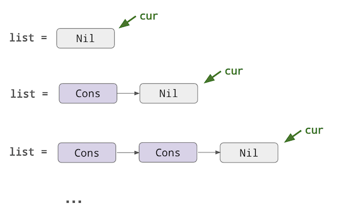
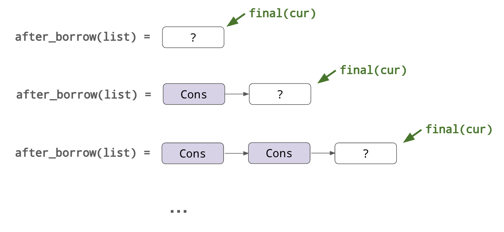

# Feature status

The content in this document applies only to Verus's **experimental**
new mutable reference support,
which can be enabled with the Verus command line option `-V new-mut-ref`.

If you're familiar with the old design, see [migration-mut-ref.md](./migration-mut-ref.md)
for more information on the transition and migration issues.

# Mutable references

For simple uses of mutable references—i.e., within a single function, and without involving
loops—Verus's proof strategy can usually track mutable references precisely and without much trouble. 
For example:

```rust
fn example1() {
    let mut a = 0;
    let a_ref = &mut a;

    *a_ref = 5;

    assert(a == 5);
}
```

Or:

```rust
fn example1() {
    let mut a = Some(0);

    match a {
        Some(inner_ref) => {
            // Obtain a reference to the contents of the Option
            *inner_ref = 20;
        }
        None => { }
    }

    assert(a == 20);
}
```

For more complex examples, we often need to write specifications about mutable references.
In the rest of the section, we'll see how to do that.

## Function specifications

One of the most common ways to work with mutable references is to have a function taking
a mutable reference as an argument. In this case, we usually need a specification that relates
the "input" value (i.e., the value behind the reference at the beginning of the function)
to the "output" (i.e., the value behind the reference at the end of the function).

```rust
fn add_1(x: &mut u8)
    requires *x < 255
    ensures *final(x) == *old(x) + 1
{
    *x += 1;
}
```

In the precondition, we use `*x` to refer to the value behind the mutable reference at the
beginning of the function. (In this case, we use the precondition to prevent overflow from the
addition operator.)
In the postcondition, we refer to both the input value (via `old`) and the output value
(via `final`).

> **Aside: Could we just use `*x` in the postcondition?**
> 
> Strictly speaking, `*x` in a specification will always refer to the value pointed to by `x`
> at the _beginning_ of the function.
> This is because `x` is an input parameter, so just like any other input parameter, it is always
> evaluated with respect to its value at call time.
>
> However, we also anticipate that this might be confusing to the untrained eye—intuitively,
> one might expect `*x` to refer to the updated value when it is used in the postcondition.
> Thus, Verus currently requires the developer to disambiguate by writing `old(x)`.
>
> _Historically_, Verus did once allow `*x` in the postcondition, where it referred to the updated
> value. However, this special case turned out to be incompatible with the formal theory
> that Verus later adopted, so this feature was removed.

## Returning mutable borrows

Let's do a more complex example, with a function that _returns_ a mutable reference.
Specifically, let's write a function that takes a `&mut (A, B)` as input and return a mutable
reference to the first field: `&mut A`.

```rust
fn get_mut_fst<A, B>(pair: &mut (A, B)) -> (ret: &mut A)
    requires ???
    ensures ???
{
    &mut pair.0
}

fn get_mut_fst_test() {
    let mut p = (10, 20);

    let r = get_mut_fst(&mut p);
    *r = 100;

    assert(p == (100, 20));
}
```

Think for a moment about how you might write a specification for `get_mut_fst`.
This is a little more challenging because the "final" value of `pair.0` isn't known concretely at
the end of the function. Instead, this value can additionally be mutated by the caller who can
manipulate the returned mutable reference, `ret`.
Therefore, the final value of `pair` needs to be _expressed in terms of_ the final value of `ret`.

Verus accepts the following specification for `get_mut_fst`, which can be used to prove `get_mut_fst_test`:

```rust
fn get_mut_fst<A, B>(pair: &mut (A, B)) -> (ret: &mut A)
    ensures
        *ret == old(pair).0,
        *final(pair) == (*final(ret), old(pair).1),
{
    &mut pair.0
}
```

Note that, even though `final(ret)` and `final(pair)` cannot be known concretely
at the end of this function (they are not known until the caller is finished with `ret`,
e.g., after the `*r = 100;` line in `get_mut_fst_test`),
this _relation_ between `final(ret)` and `final(pair)` is known.

To prove `get_mut_fst_test`, Verus reasons roughly as follows:

```rust
fn get_mut_fst_test() {
    let mut p = (10, 20);

    let r = get_mut_fst(&mut p);
    //                  ^^^^^^ call this value `pair`
    //
    // From the postcondition of `get_mut_fst` we know that:
    //    *final(pair) == (*final(r), 20)

    *r = 100;

    // Now we we know that:
    //    *final(r) == 100
    // So:
    //    *final(pair) == (100, 20)

    // Finally, since `pair` was borrowed from `p`, and the borrow has expired
    // at this point, we can deduce that:
    assert(p == (100, 20));
}
```

We'll dive deeper into Verus's encoding later.

## More examples

Here are a few more examples of functions that return mutable references.

**Returning multiple mutable references:**

```rust
fn pair_split<T, U>(pair: &mut (T, U)) -> ((fst, snd): (&mut T, &mut U))
    requires
    ensures
        *fst == old(pair).0,
        *snd == old(pair).1,
        *final(pair) == (*final(fst), *final(snd))
{
    (&mut pair.0, &mut pair.1)
}

fn pair_split_test() {
    let mut pair = (1, 2);
    let (fst, snd) = pair_split(&mut pair);
    *fst = 10;
    *snd = 20;

    assert(pair === (10, 20));
}
```

**Indexing into a vector:**

```rust
fn vec_index_mut<T>(vec: &mut Vec<T>, i: usize) -> (element: &mut T)
    requires
        0 <= i < vec.len(),
    ensures
        *element == old(vec)@[i as int],
        final(vec)@ == old(vec)@.update(i as int, *final(element)),
{
    &mut vec[i]
}

fn vec_index_mut_test() {
    let mut v = vec![10, 20];
    *vec_index_mut(&mut v, 1) = 200;

    assert(v.len() == 2);
    assert(v[0] == 10);
    assert(v[1] == 200);
}
```

## Specs about borrowed data

You might wonder what happens if you try to access a variable in spec code while it's borrowed.

```rust
fn main() {
    let mut x = 0;
    let x_ref = &mut x;

    assert(x == 0); // ??? Will this pass?

    *x_ref = 20; 
}
```

Actually, Verus forbids this, treating it similarly to a borrow error.

```
error[E0502]: cannot borrow `(Verus spec x)` as immutable because it is also borrowed as mutable
  --> simple_test.rs:9:12
   |
 7 |     let x_ref = &mut x;
   |                 ------ mutable borrow occurs here
 8 |
 9 |     assert(x == 0); // ??? Will this pass?
   |            ^ immutable borrow occurs here
10 |
11 |     *x_ref = 20;
   |     ----------- mutable borrow later used here

error: aborting due to 1 previous error
```

The phrasing of the error message might be a little cryptic; what it's trying to say is that you can't read `x`, not even in `spec` code, because `x` is currently borrowed as mutable.
(The reason for the phrasing of the error message has to do with how Verus checks for this. Verus literally injects an artificial variable called `Verus spec x` into the borrow-checking pass and forces it to be borrowed for the same lifetime as `x`.)

However, there **is** still a way to read from the value of `x`, by using the Verus builtin operator `after_borrow`. This operator allows you to read a local variable at any time, but it always gives you the value `x` _will_ have after its outstanding borrows expire. Working with this can often be a little unintuitive, and it is mainly useful for advanced situations.

For example, `after_borrow(x)` can be read even before the borrow expires:

```rust
fn main() {
    let mut x = 0;
    let x_ref = &mut x;

    assert(after_borrow(x) == after_borrow(x));

    *x_ref = 20; 
}
```

The expression `after_borrow(x)`, much like `*final(x_ref)`, is not concretely known at this point.

```rust
fn main() {
    let mut x = 0;
    let x_ref = &mut x;

    assert(after_borrow(x) == 20); // FAILS

    *x_ref = 20; 

    assert(after_borrow(x) == 20); // ok
}
```

However, much like in the specifications above, we can still describe relations between
the non-concrete values:

```rust
fn main() {
    let mut x = 0;
    let x_ref = &mut x;

    assert(after_borrow(x) == *final(x_ref));

    *x_ref = 20; 
}
```

This is essential to understanding how Verus works under the hood. To be specific,
let's dissect the following example, in particular, how Verus accepts the assert
at the end:

```rust
fn main() {
    let mut x = 0;
    let x_ref = &mut x;
    *x_ref = 20; 
    assert(x == 20);
}
```

Immediately after the line `let x_ref = &mut x`, there are three variables of interest:

 * `after_borrow(x)` - the value `x` will have after the borrow expires
 * `*x_ref` the "current" value that `x_ref` points to
 * `*final(x_ref)` the "final" value that `x_ref` will point to at the end of its life

Verus makes 2 key deductions about the above program.

```rust
fn main() {
    let mut x = 0;
    let x_ref = &mut x;

    assert(after_borrow(x) == *final(x_ref)); // (1)

    *x_ref = 20; 

    assert(has_resolved(x_ref));              // (2)

    assert(x == 20);
}
```

1. This is the relation between the final value of `x_ref` and the updated value of `x`,
   briefly mentioned above.

2. Here we have an operator, `has_resolved`, that we haven't introduced yet.
   The expression `has_resolved(x_ref)` is equivalent to `*x == *final(x)`,
   meaning `x_ref` has attained its final value, i.e., it won't be mutated subsequently.
   (These `has_resolved` predicates are inserted automatically by Verus via a reachability
   analysis considering all the program points that assign to `*x_ref`.)

Thus at program point (2) we learn that `*final(x) == *x_ref`, and of course `*x_ref == 20` 
at this point. Finally, combining with (1), we get `after_borrow(x) == 20`.

And at the end of the program, when the borrow is done, we can access plain `x` again,
which is definitionally `after_borrow(x)`. Thus we conclude that `x == 20`.

Now, let's see how to apply this knowledge.

## Working with loops

Using `after_borrow` to relate local variables to mutable references can be particularly
useful when you need to write loop invariants.

Let's do a toy example first.

Consider this (trivial) loop:

```rust
fn loop_test() -> (r: u64)
    ensures r == 30,
{
    let mut a = 0;
    let a_ref = &mut a;

    loop
        decreases 0nat
    {
        *a_ref = 30;
        return a;
    }
}
```

This fails due to the presence of the loop, which causes Verus to lose track of the relation
between `a` and `a_ref`. We just need to supply the relevant fact in the loop invariant.

```rust
fn loop_test() -> (r: u64)
    ensures r == 30,
{
    let mut a = 0;
    let a_ref = &mut a;

    loop
        invariant after_borrow(a) == *a_ref,
        decreases 0nat
    {
        *a_ref = 30;
        return a;
    }
}
```

## Building a list

Finally, let's do a more complex example to really get deeper into the mindset of
thinking about mutable references in terms of the relationships between the "final values".

Specifically, we'll see how mutable references can be used to build up a cons-list
"from the root down", and how to verify it.

```rust
enum List {
    Cons(u64, Box<List>),
    Nil,
}

fn build_zero_list(len: u64) {
    let mut list = List::Nil;
    let mut cur = &mut list;

    let mut i = 0;
    while i < len {
        *cur = List::Cons(0, Box::new(List::Nil));

        match cur {
            List::Cons(_, b) => {
                // Replace `cur` with a reference to the newly-created List::Nil,
                // the child of the previous `cur`.
                cur = &mut *b;
            }
            _ => { /* unreachable */ }
        }

        i += 1;
    }

    return list;
}
```

We start with the list (`list`) equal to `Nil` and take a reference to it (`cur`).
At each step, we replace the value pointed-to by `cur` with a `Cons` node, and then move
the reference down to the child.
Note that in this program, we both write through the cur pointer (to `*cur = ...`),
_and_ we overwrite the pointer itself (`cur = ...`).
Here, for example, we depict the state of the program at the beginning and through
the first two iterations:

<center>

</center>
(TODO alt text)

Now, let's verify this program; in particular, let us prove that the list at the end
has length equal to the input argument, `len`.

Thus, our primary goal is to prove something about the value of `list` after the initial
borrow (`cur = &mut list`) expires. 
The key to proving this is to observe that,
as the program progresses through the loop, the shape of this value
becomes more and more "concrete".

 * At the beginning of the loop, `cur` is borrowed from `list`. At this point, we have the
   freedom to set `*cur` to anything we want, so we don't know anything about the final value
   of `list`.
 * After one iteration, we've assigned that location to be a `Cons` node and replaced
   our `cur` reference with a reference to its child.
   That `Cons` node is now "set in stone"; we don't have a reference to it anymore,
   but we still have the freedom to set the child to whatever we want.
 * And so on.

<center>

</center>
(TODO alt text)

Only when the last iteration finishes and `cur` expires for good, do we learn that the
last node is "nil" and the list becomes fully concrete.

Now, this picture suggests that we can prove the program correct by writing an invariant
which relates `final(cur)` to `final(list)`.
Specifically, we can say that `final(list)` will always be equal to `final(cur)` with
`i` "Cons" nodes added to the top.

TODO need to update final to whatever keyword we choose for the local variable

```rust
enum List {
    Cons(u64, Box<List>),
    Nil,
}

spec fn append_zeros(n: nat, list: List) -> List
    decreases n
{
    if n == 0 {
        list
    } else {
        append_zeros((n-1) as nat, List::Cons(0, Box::new(list)))
    }
}

fn build_zero_list(len: u64) -> (list: List)
    ensures list == append_zeros(len as nat, List::Nil),
{
    let mut list = List::Nil;
    let mut cur = &mut list;

    let mut i = 0;
    while i < len
        invariant
            0 <= i <= len,
            *cur == List::Nil,
            after_borrow(list) == append_zeros(i as nat, *final(cur)),
        decreases len - i
    {
        *cur = List::Cons(0, Box::new(List::Nil));

        match cur {
            List::Cons(_, b) => {
                // Replace `cur` with a reference to the newly-created List::Nil,
                // the child of the previous `cur`.
                cur = &mut *b;
            }
            _ => { /* clearly unreachable */ }
        }

        i += 1;
    }

    return list;
}
```
