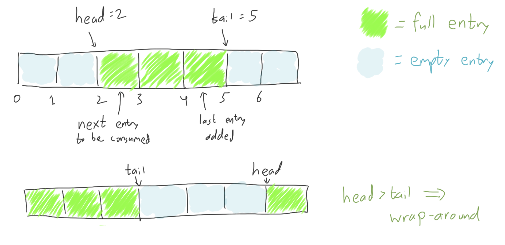
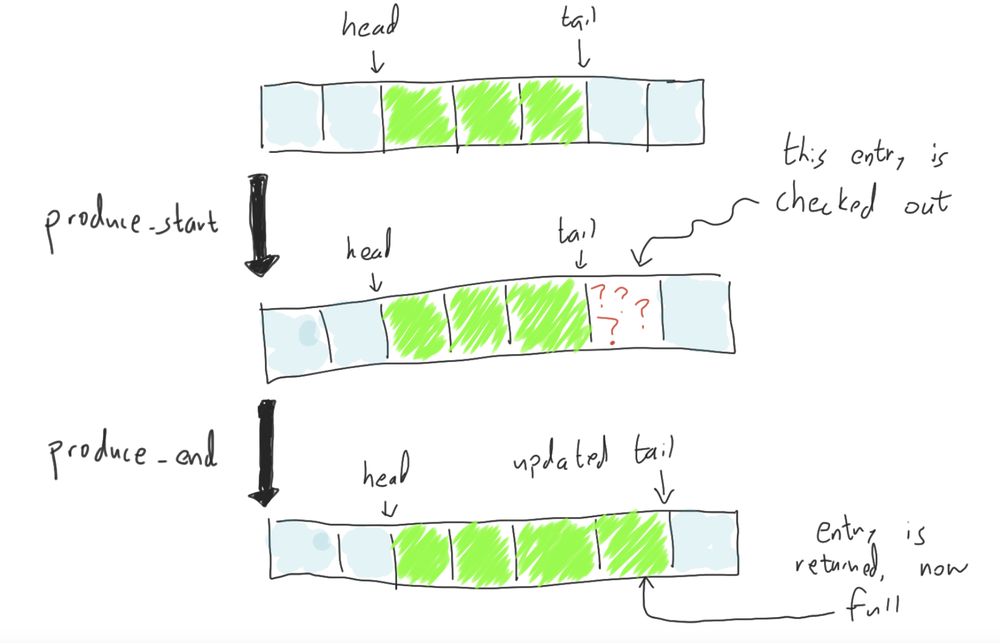

# Single-Producer, Single-Consumer queue, tutorial

Here, we'll walk through an example of verifying a single-producer, single-consumer queue.
Specifically, we're interested in the following interface:

```rust,ignore
type Producer<T>
type Consumer<T>

impl<T> Producer<T> {
    pub fn enqueue(&mut self, t: T)
}

impl<T> Consumer<T> {
    pub fn dequeue(&mut self) -> T
}

pub fn new_queue<T>(len: usize) -> (Producer<T>, Consumer<T>)
```

## Unverified implementation

First, let's discuss the reference implementation, written in ordinary Rust,
that we're going to be verifying (an equivalent of).

The implementation is going to use a ring buffer of fixed length `len`,
with a `head` and a `tail` pointer,
with the producer adding new entries to the `tail` and
the consumer popping old entries from the `head`.
Thus the entries in the range `[head, tail)` will always be full.
If `head == tail` then the ring buffer will be considered empty,
and if `head > tail`, then the interval wraps around.



The crucial design choice is what data structure to use for the buffer itself.
The key requirements of the buffer are:

 * A reference to the buffer memory must be shared between threads (the producer and the consumer)
 * Each entry might or might not store a valid `T` element at any given point in time.

In our unverified Rust implementation, we'll let each entry be an [`UnsafeCell`](https://doc.rust-lang.org/stable/std/cell/struct.UnsafeCell.html).
The `UnsafeCell` gives us [interior mutability](https://doc.rust-lang.org/book/ch15-05-interior-mutability.html), so that we can
read and write the contents from multiple threads without
any extra metadata associated to each entry. `UnsafeCell` is of course, as the name suggests, _unsafe_, meaning that it's up to the programmer to ensure the all these reads and writes are performed safely. For our purposes, safely mostly means _data-race-free_.

More specifically, we'll use an `UnsafeCell<MaybeUninit<T>>` for each entry.
The [`MaybeUninit`](https://doc.rust-lang.org/stable/std/mem/union.MaybeUninit.html)
allows for the possibility that an entry is uninitialized. Like with `UnsafeCell`, there are no
runtime safety checks, so it is entirely upon the programmer to make sure it doesn't try to read
from the entry when it's uninitialized.

> **Hang on, why not just use `Option<T>`?**
> 
> To be safer, we could use an `Option<T>` instead of `MaybeUninit<T>`, but
> we are already doing low-level data management anyway, and an `Option<T>` would be less efficient.
> In particular, if we used an `Option<T>`, then popping an entry out of the queue would mean we having
> to write `None` back into the queue to signify its emptiness.
> With `MaybeUninit<T>`, we can just move the `T` out and leave the memory "uninitialized" without actually
> having to overwrite its bytes.)

So the buffer will be represented by `UnsafeCell<MaybeUninit<T>>`.
We'll also use atomics to represent the `head` and `tail`.

```rust,ignore
{{#include ../../../../rust_verify/example/state_machines/tutorial/unverified_fifo.rs:queue}}
```

The producer and consumer types will each have a reference to the queue.
Also, the producer will have a redundant copy of the `tail` (which slightly reduces contended
access to the shared atomic `tail`), and likewise,
the consumer will have a redundant copy of the `head`.
(This is possible because we only have a single producer and consumer each
the producer is the only entity that ever updates the `tail` and
the consumer is the only entity that ever updates the `head`.)

```rust,ignore
{{#include ../../../../rust_verify/example/state_machines/tutorial/unverified_fifo.rs:producer_consumer}}
```

Finally, we come to the actual implementation:

```rust,ignore
{{#include ../../../../rust_verify/example/state_machines/tutorial/unverified_fifo.rs:impl}}
```

## Verified implementation

With verification, we always need to start with the question of what, exactly, we are
verifying. In this case, we aren't actually going to add any new specifications to
the `enqueue` or `dequeue` functions; our only aim is to implement the queue and
show that it is memory-type-safe, e.g., that `dequeue` returns a well-formed `T` value without
exhibiting any undefined behavior.

Showing this is not actually trivial! The unverified Rust code above used `unsafe` code,
which means memory-type-safety is _not_ a given.

In our verified queue implementation, we will need a safe, verified alternative to the 
`unsafe` code. We'll start with introducing our verified alternative to `UnsafeCell<MaybeUninit<T>>`.

### Verified interior mutability with `PCell`

In Verus, `PCell` (standing for "permissioned cell") is the verified equivalent.
(By equivalent, we mean that, subject to inlining and the optimizations doing what we expect,
it ought to generate the same machine code.)
Unlike `UnsafeCell`, the optional-initializedness is built-in, so `PCell<T>` can stand in
for `UnsafeCell<MaybeUninit<T>>`.

In order to verify our use of `PCell`, Verus requires the user to present a special _permission token_
on each access (read or write) to the `PCell`. Each `PCell` has a unique identifier (given by `pcell.id()`)
and each permission token connects an identifier to the (possibly uninitialized value) stored at the cell.
In the permission token, this value is represented as an `Option` type, though the option tag has no runtime representation.

```rust,ignore
{{#include ../../../../rust_verify/example/state_machines/tutorial/pcell_example.rs:example}}
```

After erasure, the above code reduces to something like this:

```rust,ignore
{{#include ../../../../rust_verify/example/state_machines/tutorial/pcell_example.rs:erased}}
```

### Using `PCell` in a verified queue.

Let's look back at the Rust code from above (the code that used `UnsafeCell`) and mark six points of interest:
four places where we manipulate an atomic and two where we manipulate a cell:

```rust,ignore
impl<T> Producer<T> {
    pub fn enqueue(&mut self, t: T) {
        loop {
            let len = self.queue.buffer.len();

            let next_tail = if self.tail + 1 == len
                { 0 } else { self.tail + 1 };

            let head = self.queue.head.load(Ordering::SeqCst);                + produce_start (atomic load)
                                                                              +
            if head != next_tail as u64 {                                     +
                unsafe {                                                      +
                    (*self.queue.buffer[self.tail].get()).write(t);           +   write to cell
                }                                                             +
                                                                              +
                self.queue.tail.store(next_tail as u64, Ordering::SeqCst);    + produce_end (atomic store)
                self.tail = next_tail;

                return;
            }
        }
    }
}

impl<T> Consumer<T> {
    pub fn dequeue(&mut self) -> T {
        loop {
            let len = self.queue.buffer.len();

            let next_head = if self.head + 1 == len
                { 0 } else { self.head + 1 };

            let tail = self.queue.tail.load(Ordering::SeqCst);                + consume_start (atomic load)
                                                                              +
            if self.head as u64 != tail {                                     +
                let t = unsafe {                                              +
                    let mut tmp = MaybeUninit::uninit();                      +
                    std::mem::swap(                                           +   read from cell
                        &mut *self.queue.buffer[self.head].get(),             +
                        &mut tmp);                                            +   
                    tmp.assume_init()                                         +
                };                                                            +
                                                                              +
                self.queue.head.store(next_head as u64, Ordering::SeqCst);    + consume_end (atomic store)
                self.head = next_head;

                return t;
            }
        }
    }
}
```

Now, if we're going to be using a `PCell` instead of an `UnsafeCell`, then at the two points where we manipulate the cell,
we are somehow going to need to have the permission token at those points.

Furthermore, we have four points that manipulate atomics. _Informally_, these atomic operations let us synchronize
access to the cell in a data-race-free way. _Formally_, in the verified setting, these atomics will let us transfer control
of the permission tokens that we need to access the cells.

Specifically:

 * `enqueue` needs to obtain the permission at `produce_start`, use it to perform a write, and relinquish it at `produce_end`.
 * `dequeue` needs to obtain the permission at `consume_start`, use it to perform a read, and relinquish it at `consume_end`.

> **Woah, woah, woah. Why is this so complicated? We marked the 6 places of interest, so now let's go
> build a `tokenized_state_machine!` with those 6 transitions already!**
>
> Good question. That approach might have worked if we were using an atomic to store the value `T`
> instead of a `PCell` (although this would, of course, require the `T` to be word-sized).
>
> However, the `PCell` requires its own considerations. The crucial point is that reading or writing
> to `PCell` is _non-atomic_. That sounds tautological, but I'm not just talking about the name of
> the type here. By _atomic_ or _non-atomic_, I'm actually referring to the atomicity of the operation
> in the execution model. We can't freely abstract `PCell` operations as atomic operations that
> allow arbitrary interleaving.
>
> **Okay, so what would go wrong in Verus if we tried?**
>
> Recall how it works for atomic memory locations.
> With an atomic memory location, we can access it any time if we just have an atomic invariant
> for it. We open the invariant (acquiring permission to access the value along with any ghost data),
> perform the operation, which is atomic, and then close the invariant.
> In this scenario, the invariant is restored after a single atomic operation, as is necessary.
>
> But we can't do the same for `PCell`.
> `PCell` operations are non-atomic, so we _can't_ perform a `PCell` read or write
> while an atomic invariant is open.
> Thus, the `PCell`'s permission token needs to be transferred at the points in the program where
> we _are_ performing atomic operations, that is, at the four marked atomic operations.

### Abstracting the program while handling permissions

Verus's `tokenized_state_machine!` supports a notion called _storage_. 
An instance of a protocol is allowed to _store_ tokens, which client threads can operate on
by temporarily "checking them out". This provides a convenient means for transferring ownership of
tokens through the system.

Think of the instance as like a library. (Actually, think of it like a network of libraries with
an inter-library loan system, where the librarians tirelessly follow a protocol to make sure any
given library has a book whenever a patron is ready to check a book out.)

Anyway, the `tokenized_state_machine!` we'll use here should look something like this:

 * It should be able to _store_ all the permission tokens for each `PCell` in the buffer.
 * It should have 4 transitions:
   * `produce_start` should allow the producer to "check out" the permission for the cell that
     it is ready to write to.
   * `produce_end` should allow the producer to "check back in" the permission that it checked out.
   * `consume_start` should allow the consumer to "check out" the permission for the cell that
     it is ready to read from.
   * `consume_end` should allow the consumer to "check back in" the permission that it checked out.
 
> **Hang on, I read ahead and learned that Verus's storage mechanism has a different mechanism for handling reads. Why aren't we using that for the consumer?**
>
> A few reasons.
>
> 1. That mechanism is useful specifically for read-_sharing_, which we aren't using here.
> 2. We actually can't use it, since the "read" isn't _really_ a read. Well, at the byte-level, it
>     should just be a read. But we actually _do_ change the value that is stored there in the high-level
>     program semantics: we move the value out and replaced it with an "uninitialized" value.
>     And we have to do it this way, unless `T` implemented `Copy`.

The producer and consumer each have a small "view into the world": each one might have access to one
of the permission tokens if they have it "checked out", but that's it.

To understand the state machine protocol we're going to build, we have to look at the protocol dually to the producer
and the consumer. If the producer and consumer might have 0 or 1 permissions checked out at a given time,
then complementarily, the protocol state should be "almost all of the permissions, except possibly up to 2 permissions that
are currently checked out".

For example, here is the full sequence of operations for an `enqueue` step, both from the perspective of the producer
and of the storage protocol:

| operation         | Producer's perspective                            | Storage protocol's perspective                   |
|-------------------|---------------------------------------------------|--------------------------------------------------|
| `produce_start`   | receives a permission for an uninitialized cell   | lends out a permission for an uninitialized cell |
| write to the cell | writes to the cell with `PCell::put`              |                                                  |
| `produce_end`     | returns a permission for the now-initialized cell | receives back the permission, now initialized    |

And here is the storage protocol's perspective, graphically:



### Building the `tokenized_state_machine!`

Now that we finally have a handle on the protocol, let's implement it. It should have all the following state:

 * The value of the shared `head` atomic
 * The value of the shared `tail` atomic
 * The producer's state
   * Is the producer step in progress?
   * Local `tail` field saved by the producer
 * The consumer's state
   * Is the consumer step in progress?
   * Local `head` field saved by the producer
 * The IDs of cells in the buffer (so we know what permissions we're meant to be storing)
 * The permissions that are actually stored.

And now, in code:

```rust,ignore
{{#include ../../../../rust_verify/example/state_machines/tutorial/fifo.rs:enum_state}}

{{#include ../../../../rust_verify/example/state_machines/tutorial/fifo.rs:fields}}
    // ...
}}
```

As you can see, Verus allows us to utilize storage by declaring it in the sharding strategy.
Here, the strategy we use is `storage_map`. In the `storage_map` strategy,
the stored token items are given by the values in the map.
The keys in the map can be an arbitrary type that we choose to use as an index to refer to
stored items. Here, the index we'll use will just the index into the queue.
Thus keys of the `storage` map will take on values in the range `[0, len)`.

> **Hmm. For a second, I thought you were going to use the cell IDs as keys in the map.
> Could it work that way as well?**
>
> Yes, although it would be slightly more complicated. For one, we'd need to track an invariant
> that all the IDs are distinct, just to show that there aren't overlapping keys.
> But that's an extra invariant to prove that we don't need if we do it this way.
> Much easier to declare a correspondance between `backing_cells[i]` and `storage[i]` for each `i`.
>
> **Wait, does that mean we _aren't_ going to prove an invariant that all the IDs are distinct?
> That can't possibly be right, right?**
>
> It _does_ mean that!
>
> Certainly, it _is_ true that in any execution of the program, the IDs of the cells are going to
> be distinct, but this isn't something we need to track ourselves as users of the `PCell` library.
>
> You might be familiar with an approach where we have some kind of "heap model," which maps
> addresses to values. When we update one entry, we have to show how nothing else of interest
> is changing. But like I just said, we aren't using that sort of heap model in the `Fifo` protocol,
> we're just indexing based on queue index. And we don't rely on any sort of heap model like that
> in the implementations of `enqueue` or `dequeue` either; there, we use the separated permission model.

Now, let's dive into the transitions. Let's start with `produce_start` transition.

```rust,ignore
{{#include ../../../../rust_verify/example/state_machines/tutorial/fifo.rs:transition_produce_start}}
```

It's a doozy, but we just need to break it down into three parts:

 * The enabling conditions (`require`).
   * The client needs to exhibit that these conditions hold
       (e.g., by doing the approparite comparison between the `head` and `tail` values) in order
       to perform the transition.
 * The stuff that gets updated:
   * We `update` the producer's local state
   * We `withdraw` ("check out") the permission, which is represented simply by removing the key from the map.
 * Guarantees about the result of the transition.
   * These guarantees will follow from internal invariants about the `FifoQueue` system
   * In this case, we care about guarantees on the permission token that is checked out.

Now, let's see `produce_end`. The main difference, here, is that the client is checking the permission token
back into the system, which means we have to provide the guarantees about the permission token
in the enabing condition rather than in a post-guarantee.

```rust,ignore
{{#include ../../../../rust_verify/example/state_machines/tutorial/fifo.rs:transition_produce_end}}
```

Check the [full source](./src-producer-consumer-queue.md) for the `consume_start` and `consume_end` transitions, which are pretty similar,
and for the invariants we use to prove that the transitions are all well-formed.

### Verified Implementation

For the implementation, let's start with the definitions for the `Producer`, `Consumer`, and `Queue` structs,
which are based on the ones from the unverified implementation, augmented with `proof` variables.
The `Producer`, for example, gets a proof token for the `producer: ProducerState` field.

The well-formedness condition here demands us to be in the `ProducerState::Idle` state
(in every call to `enqueue`, we must start and end in the `Idle` state).

```rust,ignore
{{#include ../../../../rust_verify/example/state_machines/tutorial/fifo.rs:impl_producer_struct}}
```

For the `Queue` type itself, we add an atomic invariant for the `head` and `tail` fields:

```rust,ignore
{{#include ../../../../rust_verify/example/state_machines/tutorial/fifo.rs:impl_queue_struct}}
```

Now we can implement and verify `enqueue`:

```rust,ignore
{{#include ../../../../rust_verify/example/state_machines/tutorial/fifo.rs:impl_producer}}
```
