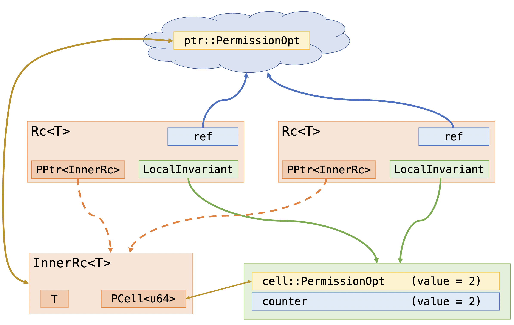
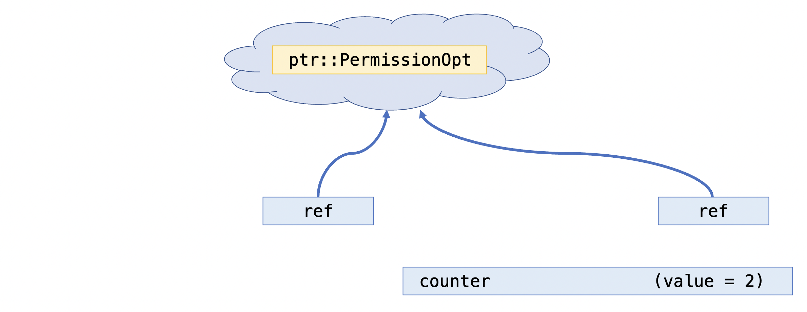

# Reference-counted smart pointer, tutorial

Our next example is a reference-counted smart pointer like
[`Rc`](https://doc.rust-lang.org/std/rc/struct.Rc.html).

We're going to focus on 4 functions: `new`, `clone`, and `drop`, and `borrow`.
The `clone` and `drop` functions will be incrementing and decrementing
the reference count, and `drop` will be responsible for freeing memory when
the count hits zero.
Meanwhile, the `borrow` function provides access to the underlying data.
Recall that since `Rc` is a shareable pointer, the underlying data must be
accessed via shared pointer.

```rust,ignore
type Rc<T>

impl<T> Rc<T> {
    pub spec fn view(&self) -> T;

    pub fn new(t: T) -> (rc: Self)
        ensures rc@ === t

    pub fn clone(&self) -> (rc: Self)
        ensures rc@ === self@

    pub fn drop(self)

    pub fn borrow(&self) -> (t: &T)
        ensures *t === self@
}
```

In terms of specification, the `view()` interpretation of an `Rc<T>` object
will simply be the underlying `T`, as is reflected in the post-conditions above.

**NOTE:** A current limitation, at the time of writing, is that
Verus doesn't yet have proper support for `Drop`,
so the `drop` function of our `Rc` here needs to be called manually to avoid
memory leaks.

## Unverified implementation

As usual, we'll start with an unverified implementation.

```rust,ignore
{{#include ../../../../rust_verify/example/state_machines/tutorial/unverified_rc.rs:full}}
```

## Verified implementation

The main challenge here is to figure out what structure the ghost code will take.

 * We need a "something" that will let us get the `&PointsTo` object that we need
    to dereference the pointer. This has to be a shared reference by necessity.
 * The "something" needs to be duplicateable somehow; we need to obtain a new one whenever
    we call `Rc::clone`.
     * The counter, somehow, needs to correspond to the number of "somethings" in existence.
       In other words, we should be able to get a new "something" when we increment
       the counter, and we should destroy a "something" when we decrement it.
 * We need a way to obtain ownership of the the `PointsTo` object for the `PCell`
    storing the counter, so that we can write to it.

Let's stop being coy and name the ghost components. The "something" is the driver of action
here, so let's go ahead and call it a `ref`.
Let's have another ghost object called a `counter`---the `counter` counts the `ref`s.
The ghost `counter` needs to be tied to the actual `u64` counter,
which we will do with a `LocalInvariant`.

Therefore, an `Rc` ought to have:

 * A `ref` object, which will somehow let us obtain access a `&ptr::PointsTo<InnerRc>`.
 * A `LocalInvariant` storing both a `counter` and a `cell::PointsTo<u64>`.



Now, with this rough plan in place, we can finally begin devising our `tokenized_state_machine`
to define the `ref` and `counter` tokens along with the relationship between the
`ref` token and the `ptr::PointsTo`.



```rust
{{#include ../../../../rust_verify/example/state_machines/tutorial/rc.rs:fields}}
```

TODO - finish the rest of this tutorial
