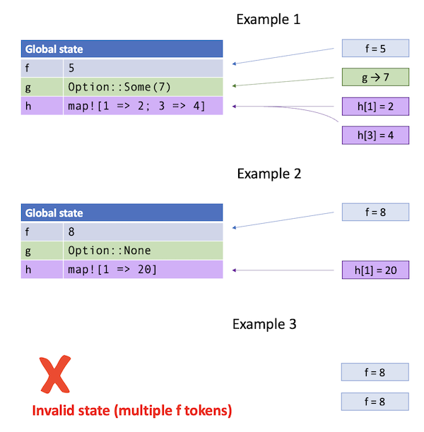

# Strategy Reference

In a tokenized state machine, Verus produces a set of _token types_ such that any
state of the system represents some collection of objects of those types.
This tokenization process is determined by a _strategy_ declared on each field of
the state definition.
Specifically, for each field, Verus (potentially) generates a token type for the field
depending on the declared strategy, with the strategy determining some
relationship between the state's field value and a collection of such tokens.
The entire state, consisting of _all_ fields, then corresponds to a collection of objects
out of all the defined token types.

 * For example, consider a field `f` of type `T` with strategy `variable`.
   In this case, the token type (named `f`) has a value `T` on it, and we require the collection
   to always have exactly one such token, giving, of course, the value of `f`.

 * On the other hand, consider a field `g` of type `Map<K, V>` with strategy `map`.
   In this case, the token types have pairs `(k, v)`. The collection can have any number of
   tokens, although they have to all have distinct keys, and the pairs all together form a 
   map which gives the value of field `g`.

 * Or consider a field `h` of type `Option<V>` with strategy `option`.
   In this case, the token type has a value `v: V`, and the collection must contain either
   no tokens for this type (yielding `Option::None`), or exactly one
   (yielding `Option::Some(v)`).



Each transition of the system can be viewed both as a transition relation in the same sense
as in an orindary transition, but _also_ as an "exchange" of tokens,
where a sub-collection of tokens is taken in (consumed) and exchanged for a new sub-collection.
All of the rules we discuss below are meant to ensure that
each exchange performed on a valid collection will result in another valid collection
and that the corresponding global system states transition according to the relation.

## The `Instance` token and the `constant` strategy

Every tokenized state machine generates a special `Instance` token type.
Besides serving as a convenient object with which to serve the exchange function API,
the `Instance` also serves as "unique identifier" for a given instantiation of the protocol.
All other token types have an `instance: Instance` field, and in any exchange, all
of these instance markers are required to match.

The `Instance` type implements `Clone`, so it can be freely shared by all the clients
that need to manipulate some aspect of the protocol.

The `Instance` type also contains all fields declared with the `constant` strategy,
accessed as `instance.field_name()`. Fields with the `constant` strategy cannot be updated
after the protocol has been initialized, so this information will never be inconsistent.
Furthermore, `constant` fields do not not generate their own constant types.

## The `variable` strategy

If a field `f` has strategy `variable`, then Verus generates a token type `f`, with values
given by `token![$instance => f => $value]`.

Verus enforces that there is always exactly one token of the type `f`.

(Technical note: the reader might wonder what happens if the user attempts to `drop` the token.
This is allowed because dropped tokens are still considered to "exist" in the perspective of the abstract ghost program. Dropping a token only means that it is made inaccessible.)

The value of a `variable` field is manipulated using the ordinary `update` command, as in
ordinary transition definitions. The old value can be accessed as usual with `pre.f`.

If `f` is updated by a transition, then the corresponding exchange function takes an `f`
taken as an `&mut` argument. If `f` is read (via `pre.f`) but never updated, then it is
read as an `&` argument.
If the field is neither read nor written by the transition, then it is not taken as
an argument.

## The "collection-style" strategies with `remove`/`have`/`add`

(TODO not all of these exist yet)

A large number of tokenization strategies are specified in what we call _collection-style_
or _monoid-style_. Specifically, this includes
`option`, `map`, `multiset`, `set`, `count`, and `bool`,
as well as their "persistent" verions
`persistent_option`, `persistent_map`, `persistent_set`, `persistent_count`, and `persistent_bool`.

### Basic Collection Strategies


| Strategy | Type          | Token value                          | Requirements / relationship to field value                         |
|----------|---------------|--------------------------------------|--------------------------------------------------------------------|
| option   | `Option<V>`   | `token![$instance => f => $v]`       | No token for `None`, one token for `Some(v)`.                      |
| map      | `Map<K, V>`   | `token![$instance => f => $k => $v]` | At most one token for any given value of `k`.                      |
| multiset | `Multiset<V>` | `token![$instance => f => $v]`       | No restrictions.                                                   |
| set      | `Set<V>`      | `token![$instance => f => $v]`       | At most one token for any given value of `v`.                      |
| count    | `nat`         | `token![$instance => f => $n]`       | Any number of tokens; the sum of all tokens gives the field value. |
| bool     | `bool`        | `token![$instance => f => true]`     | Token either exists (for `true`) or doesn't exist (for `false`).   |

(In the table, `v` has type `V`, `k` has type `K`, `n` has type `nat`, and `b` has type `bool`.)

Initially, some of these might seem odd---why, for example, does `bool` have a `true` token, and no `false` token?
However, if the user wants a `false` token, they can just use the `variable` strategy. Instead, `bool`, here, is meant to
represent the case where we want a token that either exists, or doesn't, with no other information, and the natural
representation of such a thing is a bool. (Actually, `bool` is just isomorphic to `Option<()>`.)

Describing transitions for these collection types is somewhat more involved. Note that a user _cannot_ in general
establish the exact value of one of these fields simply by providing some tokens for the field, since it's always possible
that there are other tokens elsewhere. As such, the values of these fields are not manipulated through _update_ but through
three commands called `remove`, `have`, and `add`.

To describe these, we will first establish a notion of _composition_ on the field types.
Specifically, we define the composition `a · b` by the idea that if `a` and `b` each represent some collection
of tokens, then `a · b` should represent the union of those two collections.
Of course, this may not always be well defined: as we have discussed, not all possible collections of tokens
are valid collections for the given strategy. Thus, we let `a ## b` indicate that the composition is well-defined.

(Note: these operators are for documentation purposes only; currently, they are not operators that can be used in Verus code.)

| Strategy | `a ## b`                     | `a · b`                         |
|----------|------------------------------|---------------------------------|
| option   | <code>a === None \|\| b === None</code> | `if a == None { b } else { a }` |
| map      | `a.dom().disjoint(b.dom())`  | `a.union_prefer_right(b)`       |
| multiset | `true`                       | `a.add(b)`                      |
| set      | `a.disjoint(b)`              | `a.union(b)`                    |
| count    | `true`                       | `a + b`                         |
| bool     | `!(a && b)`                  | <code>a \|\| b</code>           |

Note that despite any apparent asymmetries, `a · b` is always commutative whenever `a ## b`, and these definitions
are all consistent with the union of token collections, given by the relationships in the above table.

Now, write `a >= b` if there exists some value `c` such that `a · c = b`.
Note that `c` is always unique when it exists. (This property is called _cancellativity_,
and it is not in general true for a monoid; however, it is true for all the ones we consider here.)
When `a >= b`, let `a - b` denote that unique value.

Now, with these operators defined, we can give a general meaning for the three transition commands,
`remove`, `have`, and `add`, in terms of [`require`, `update`, and `assert`](./transition-language.md).

| Command            | Meaning as transition on state      | Meaning for exchange function           |
|--------------------|-------------------------------------|-----------------------------------------|
| `remove f -= (x);` | `require f >= x;`<br>`update f = f - x;` | Input argument, consumed           |
| `have f >= (x);`   | `require f >= x;`                   | Input argument of type `&_`             |
| `add f += (x);`    | `assert f ## x;`<br>`update f = f · x;`  | Output argument                    |

Furthermore, for a given field, the commands always go in the order `remove` before `have` before `add`.
There could be multiple, or none, of each one.
The reason is that ordering would not impact the definition of the exchange function; furthermore,
this particular ordering gives the strongest possible relation definition, so it the easiest to work with.
For example, a `remove` followed by a `have` will capture the fact the two values used as arguments
must be disjoint by `##`.

Unfortunately, the _type_ of the input or output argument is, in general, somewhat complicated,
since it needs to correspond to the value `x` in the above table, which takes on the same type as the
field.
For example, suppose `f` and `x` take on values of type `Map<K, V>` with the `map` strategy.
In that case, the _token type_ (named `f`) represents only a single (key, value) pair of the map,
and the `tracked` objects passed into or out of the exchange function would need to be
_maps_ of tokens. (TODO link to documentation about using tracked maps)
The same is true of `option`, `set`, and `multiset`.

In the _common case_, transitions are defined so that arguments in or out are just single tokens
of the token type `f`, in the form given [in the above table](#basic-collection-strategies).
(The primary exceptions are output arguments [of the `init` routines](#init)
or large, bulk transitions that operate on a lot of state.)
The `remove`, `have`, and `add` commands all allows a syntactic shorthand for "singleton" elements:

 * `add f += Some(x)` is for `option`
 * `add f += [k => v]` is for `map` singletons
 * `add f += {x}` is for `multiset` and `set` singletons

Of course, this applies to `remove` and `have` as well.

The general form is `add f += (x)` as above, with `x` taking the same type as field `f`.
(The parentheses are necessary.)
The general form works for all the collection strategies.

Note that there is no "special" form for either `count`, since the general form
is perfectly suitable for those situations.

Also note that the special forms generate simpler proof obligations, and thus are
easier for the SMT solver to handle.

We supply, here, a reference table for all the different possible commands for each strategy:

| Type          | Command                 | Meaning in transition                                                                 | Exchange Fn Parameter |
|---------------|-------------------------|---------------------------------------------------------------------------------------|-----------------------|
|&nbsp;         |                         |                                                                                       |                       |
| `Option<V>`   | `remove f -= Some(v);`  | `require f === Some(v);`<br>`update f = None;`                                        | Input `f`             |
| `Option<V>`   | `have f >= Some(v);`    | `require f === Some(v);`                                                              | Input `&f`            |
| `Option<V>`   | `add f += Some(v);`     | `assert f === None;`<br>`update f = Some(v);`                                         | Output `f`            |
|&nbsp;         |                         |                                                                                       |                       |
| `Option<V>`   | `remove f -= (x);`      | <code>require x === None \|\| f === x;</code><br>`update f = if x === None { f } else { None };` | Input `Option<f>`     |
| `Option<V>`   | `have f >= (x);`        | <code>require x === None \|\| f === x;</code>                                                    | Input `&Option<f>`    |
| `Option<V>`   | `add f += (x);`         | <code>assert f === None \|\| x === None;</code><br>`update f = if x === None { f } else { x };`  | Output `Option<f>`    |
|&nbsp;         |                         |                                                                                       |                       |
| `Map<K, V>`   | `remove f -= [k => v];` | `require f.contains(k) && f.index(k) === v;`<br>`update f = f.remove(k);`             | Input `f`             |
| `Map<K, V>`   | `have f >= [k => v];`   | `require f.contains(k) && f.index(k) === v;`                                          | Input `&f`            |
| `Map<K, V>`   | `add f += [k => v];`    | `assert !f.contains(k);`<br>`update f = f.insert(k, v);`                              | Output `f`            |
|&nbsp;         |                         |                                                                                       |                       |
| `Map<K, V>`   | `remove f -= (x);`      | `require x.le(f);`<br>`update f = f.remove_keys(x.dom());`                            | Input `Map<K, f>`     |
| `Map<K, V>`   | `have f >= (x);`        | `require x.le(f);`                                                                    | Input `&Map<K, f>`    |
| `Map<K, V>`   | `add f += (x);`         | `assert x.dom().disjoint(f.dom();)`<br>`update f = f.union_prefer_right(x);`          | Output `Map<K, f>`    |
|&nbsp;         |                         |                                                                                       |                       |
| `Multiset<V>` | `remove f -= {v};`      | `require f.count(v) >= 1;`<br>`update f = f.remove(v);`                               | Input `f`             |
| `Multiset<V>` | `have f >= {v};`        | `require f.count(v) >= 1;`                                                            | Input `&f`            |
| `Multiset<V>` | `add f += {v};`         | `update f = f.insert(v);`                                                             | Output `f`            |
|&nbsp;         |                         |                                                                                       |                       |
| `Multiset<V>` | `remove f -= (x);`      | `require x.le(f);`<br>`update f = f.sub(x);`                                          | Input `Multiset<f>`   |
| `Multiset<V>` | `have f >= (x);`        | `require x.le(f);`                                                                    | Input `&Multiset<f>`  |
| `Multiset<V>` | `add f += (x);`         | `update f = f.add(x);`                                                                | Output `Multiset<f>`  |
|&nbsp;         |                         |                                                                                       |                       |
| `Set<V>`      | `remove f -= {v};`      | `require f.contains(v);`<br>`update f = f.remove(v);`                                 | Input `f`             |
| `Set<V>`      | `have f >= {v};`        | `require f.contains(v);`                                                              | Input `&f`            |
| `Set<V>`      | `add f += {v};`         | `assert !f.contains(v);`<br>`update f = f.insert(v);`                                 | Output `f`            |
|&nbsp;         |                         |                                                                                       |                       |
| `Set<V>`      | `remove f -= (x);`      | `require x.subset_of(f);`<br>`update f = f.difference(x);`                            | Input `Set<f>`        |
| `Set<V>`      | `have f >= (x);`        | `require x.subset_of(f);`                                                             | Input `&Set<f>`       |
| `Set<V>`      | `add f += (x);`         | `assert f.disjoin(t);`<br>`update f = f.union(x);`                                    | Output `Set<f>`       |
|&nbsp;         |                         |                                                                                       |                       |
| `nat`         | `remove f -= (x);`      | `require f >= x;`<br>`update f = f - x;`                                              | Input `f`             |
| `nat`         | `have f >= (x);`        | `require f >= x;`                                                                     | Input `&f`            |
| `nat`         | `add f += (x);`         | `update f = f + x;`                                                                   | Output `f`            |
|&nbsp;         |                         |                                                                                       |                       |
| `bool`        | `remove f -= true;`     | `require f == true;`<br>`update f = false;`                                           | Input `f`             |
| `bool`        | `have f >= true;`       | `require f == true;`                                                                  | Input `&f`            |
| `bool`        | `add f += true;`        | `assert f == false;`<br>`update f = true;`                                            | Output `f`            |
|&nbsp;         |                         |                                                                                       |                       |
| `bool`        | `remove f -= (x);`      | `require x ==> f;`<br>`update f = f && !x;`                                           | Input `Option<f>`     |
| `bool`        | `have f >= (x);`        | `require x ==> f;`                                                                    | Input `&Option<f>`    |
| `bool`        | `add f += (x);`         | `assert !(f && x);`<br><code>update f = f \|\| x;</code>                              | Output `Option<f>`    |


### Persistent Collection Strategies

Verus supports "persistent" versions for several of the collection types:
`persistent_option`, `persistent_map`, `persistent_set`, `persistent_count`, and `persistent_bool`.

By "persistent", we mean that any state introduced is permanent.

 * `persistent_option`: once a value becomes `Some(x)`, it will always remain `Some(x)`.
 * `persistent_map`: once a (key, value) pair is inserted, that key will always remain, and its value will never change.
 * `persistent_set`: once a value is inserted, that value will remain
 * `persistent_count`: the number can never decrease
 * `persistent_bool`: once it becomes true, it can never become false.

As a result, we can remove the uniqueness constraints on the tokens,
and we can implement `Clone` on the token type.
In other words, for a given token (say, `token![instance => f => k => v]`)
we can freely make clones of that token without tracking the number of clones.

| Strategy | `a ## b`                     | `a · b`                         |
|----------|------------------------------|---------------------------------|
| `persistent_option`   | <code>a === None \|\| b === None \|\| a === b</code> | `if a == None { b } else { a }` |
| `persistent_map`      | `a.agrees(b)`                | `a.union_prefer_right(b)`       |
| `persistent_set`      | `true`                       | `a.union(b)`                    |
| `persistent_count`    | `true`                       | `max(a, b)`                     |
| `persistent_bool`     | `true`                       | <code>a \|\| b</code>           |

Unlike before, `a ## a` always holds (with `a · a = a`).
At a technical level,
this property is what makes it safe to implement `Clone` on the tokens.

This property also lets us see why we cannot `remove` state.
These monoids are not _cancellative_ like the above; in particular,
if we have state `a` and attempt
to "subtract" `a`, then we might still be left with `a`.
Thus, from the perspective of the transition system, there can never be any point
to doing a remove.

`have` and `add` are specified in the same methodology as above, which amounts to the following:

| Type            | Command               | Meaning in transition                                                                             | Exchange Fn Parameter |
|-----------------|-----------------------|---------------------------------------------------------------------------------------------------|-----------------------|
| &nbsp;          |                       |                                                                                                   |                       |
| `Option<V>`     | `have f >= Some(v);`  | `require f === Some(v);`                                                                          | Input `&f`            |
| `Option<V>`     | `add f += Some(v);`   | <code>assert f === None \|\| f === Some(v);</code><br>`update f = Some(v);`                       | Output `f`            |
| &nbsp;          |                       |                                                                                                   |                       |
| `Option<V>`     | `have f >= (x);`      | <code>require x === None \|\| f === x;</code>                                                     | Input `&Option<f>`    |
| `Option<V>`     | `add f += (x);`       | <code>assert f === None \|\| x === None \|\| f === x;</code><br>`update f = if x === None { f } else { x };` | Output `Option<f>`    |
| &nbsp;          |                       |                                                                                                   |                       |
| `Map<K, V>`     | `have f >= [k => v];` | `require f.contains(k) && f.index(k) === v;`                                                      | Input `&f`            |
| `Map<K, V>`     | `add f += [k => v];`  | `assert f.contains(k) ==> f.index(k) === v;`<br>`update f = f.insert(k, v);`                      | Output `f`            |
| &nbsp;          |                       |                                                                                                   |                       |
| `Map<K, V>`     | `have f >= (x);`      | `require x.le(f);`                                                                                | Input `&Map<K, f>`    |
| `Map<K, V>`     | `add f += (x);`       | `assert x.agrees(f)`<br>`update f = f.union_prefer_right(x);`                                     | Output `Map<K, f>`    |
| &nbsp;          |                       |                                                                                                   |                       |
| `Set<V>`        | `have f >= {v};`      | `require f.contains(v);`                                                                          | Input `&f`            |
| `Set<V>`        | `add f += {v};`       | `update f = f.insert(v);`                                                                         | Output `f`            |
| &nbsp;          |                       |                                                                                                   |                       |
| `Set<V>`        | `have f >= (x);`      | `require x.subset_of(f);`                                                                         | Input `&Set<f>`       |
| `Set<V>`        | `add f += (x);`       | `update f = f.union(x);`                                                                          | Output `Set<f>`       |
| &nbsp;          |                       |                                                                                                   |                       |
| `nat`           | `have f >= (x);`      | `require f >= x;`                                                                                 | Input `&f`            |
| `nat`           | `add f += (x);`       | `update f = max(f, x);`                                                                           | Output `f`            |
| &nbsp;          |                       |                                                                                                   |                       |
| `bool`          | `have f >= true;`     | `require f == true;`                                                                              | Input `&f`            |
| `bool`          | `add f += true;`      | `update f = true;`                                                                                | Output `f`            |
| &nbsp;          |                       |                                                                                                   |                       |
| `bool`          | `have f >= (x);`      | `require x ==> f;`                                                                                | Input `&Option<f>`    |
| `bool`          | `add f += (x);`       | <code>update f = f \|\| x</code>                                                                  | Output `Option<f>`    |

### Inherent Safety Conditions

Above, we discussed the general meanings of `remove`, `have`, and `add`, which we repeat here
for reference:

| Command            | Meaning as transition on state      | Meaning for exchange function           |
|--------------------|-------------------------------------|-----------------------------------------|
| `remove f -= (x);` | `require f >= x;`<br>`update f = f - x;` | Input argument, consumed           |
| `have f >= (x);`   | `require f >= x;`                   | Input argument of type `&_`             |
| `add f += (x);`    | `assert f ## x;`<br>`update f = f · x;`  | Output argument                    |

The reader may wonder, why do we use `assert` for `add`, but not for the other two?

In the case of `remove` and `have`, we allow `f >= x` to be an enabling condition, and it is then
possible for the client of an exchange function to justify that the enabling condition is met by 
the existence of the tokens that it inputs.

In the case of `add`, however, there is no such justification because the tokens that correspond to `x`
are _output_ tokens. These tokens do not exist before the transition occurs, so we cannot use their
existence to justify the transition is safe. Rather, it is up to the developer of the transition system
to show that introducing the state given by `x` is always safe. Hence, we use `assert` to create a safety condition.
We call this the _inherent safety condition_ of the `add` command.

As with any ordinary `assert`, the developer is expected to show that it follows from the invariant
and from any preceeding enabling conditions.
If the proof, does not go through automatically, the developer can supply a proof body using `by`, e.g.,:

```rust,ignore
add f += Some(v) by {
    // proof that pre.f === None
};
```

### Init

TODO

### Pattern matching with `remove` and `have`

